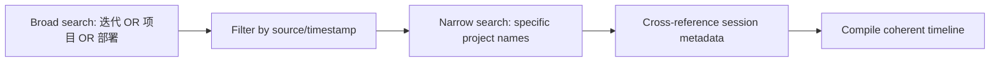

# Session Timeline Reconstruction

> Technique: Use `session_search` to reconstruct multi-day project timelines from agent work history.
> 
> Use case: User asks "汇总过去N天完成了多少项目/迭代" or any historical work summary.

## Core Technique



## Step-by-Step

### Step 1: Broad sweep search

Query `session_search` with AND/OR of high-frequency keywords that appear across all your work:

```
迭代 OR 项目 OR 部署 OR 自动化 OR 配置 OR 安装 OR 修复
```

This catches most project work. Include any known project codenames from memory.

### Step 2: Date narrow

No date filter in session_search — instead, narrow by project-specific keywords:

```
Italy Lux 旅行 规划 OR VisePanda go2china OR Region Planner OR 模型 路由
```

### Step 3: Cross-reference metadata

Each session result returns:
- `when`: exact timestamp
- `source`: weixin / yuanbao / cron / lightclawbot / cli — filter out `cron` (automated tasks, not user projects)
- `model`: deepseek-v4-flash / deepseek-v4-pro — high-end models indicate complex work
- `summary`: full text summary of what happened

Use the `when` field to group sessions into days. Use `summary` to extract iteration counts, project versions, deployment URLs.

### Step 4: Compile output

Output format (user-tested, preferred structure):

```markdown
## 📊 [N]日全览

### 项目 X：[项目名]
**时间：** 日期范围
**迭代：** N 次
**版本：** vX → vY

| 阶段 | 日期 | 内容 |
|------|------|------|
| [阶段名] | 月/日 | 做了什么 |

- **产出：** 文件列表
- **部署：** URL
```

### Known Pitfalls

- **Cron sessions pollute results.** Source=`cron` sessions are automated tasks (news briefings, monitors). Filter them out unless they're relevant.
- **No May 17-18 sessions in search.** Earlier sessions (before ~May 19) may not be indexed. Note gaps explicitly.
- **Session_search max 5 results per query.** You may need multiple narrow queries to get full coverage.
- **`summary` field is a pre-compiled summary, not raw transcript.** Trust it for facts (dates, version numbers, iteration counts) but verify specific claims against each other.
- **User counts "迭代" differently.** One "迭代" = one logical feature addition, not one git commit or one tool call. The Italy Lux project had 50 iterations (I1-I50) counted by the user's own naming scheme.
